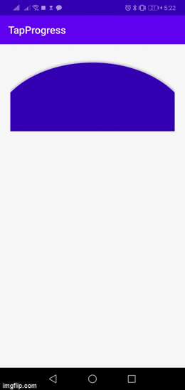

# TapProgress

[](https://jitpack.io/#HasibPrince/TapProgress)

TapProgress is used for any secured operation to prevent unintentional users' interaction. Sucha as: Banking operation.



Setup
------
TapProgress required minSdkVersion 21 and androidx

Add it in your project level build.gradle at the end of repositories:

```
allprojects {
 repositories {
  ...
	maven { url 'https://jitpack.io' }
 }
}
```
Add the dependency in your app.gradle file:
```
dependencies {
	implementation 'com.github.HasibPrince:TapProgress:Tag'
}
```

Usage
--------
```xml
<com.example.library.TapProgress
        android:id="@+id/tapProgress"
        android:layout_width="match_parent"
        android:layout_height="150dp"
        app:tpArc_strokeWidth= "6dp"
        app:tpArc_Distance="10dp"
        app:tpArc_solidArcColor= "@color/colorPrimaryDark"
        app:tpArc_strokeArcColor="@color/colorPrimary"
        app:tpArc_duration="2000"
        android:layout_marginTop="20dp"
        android:layout_marginLeft="20dp"
        android:layout_marginRight="20dp"
        app:layout_constraintLeft_toLeftOf="parent"
        app:layout_constraintRight_toRightOf="parent"
        app:layout_constraintTop_toTopOf="parent"/>
```
To get callback of progress completed:
```kotlin
class MainActivity : AppCompatActivity() {

    override fun onCreate(savedInstanceState: Bundle?) {
        super.onCreate(savedInstanceState)
        setContentView(R.layout.activity_main)
        tapProgress?.setTapProgressCompletedListener(object : TapProgress.TapProgressCompletedListener{
            override fun onTapProgressCompleted() {
                //write your code
            }

        })
    }
}
```
